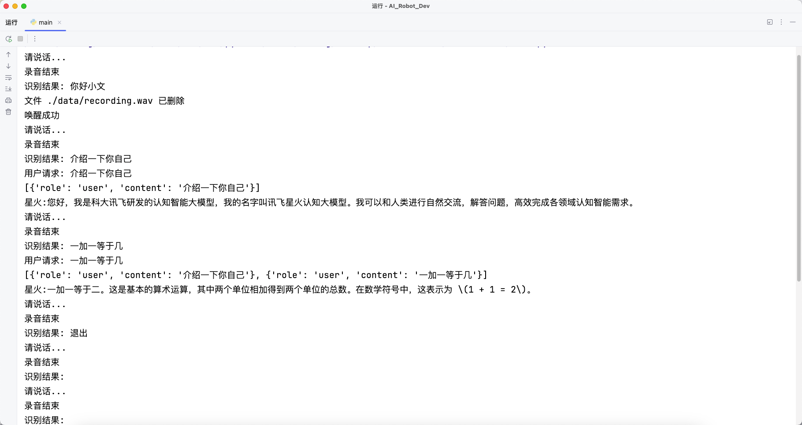

# AI_Robot_Dev
College Student Innovation and Entrepreneurship Project:
Intelligent Home Robot Development Warehouse (He Long)
---
Develop Environment:
    Raspberrypi 5 4GB
        Debian 12 On Arm (64Bit)
    Python 3.11.2
    ROS For Debian
        
---
1. Intelligent chat function (ASR+LLM+TTS implementation)

   Access to the iFLYTEK Xinghuo intelligent large model and Baidu speech recognition model
    (castrated models such as 7b can also be deployed locally, taking into account the actual simulation platform performance), to achieve voice wake-up, intelligent multi-round dialogue, and semantic division
    
    

2. 
